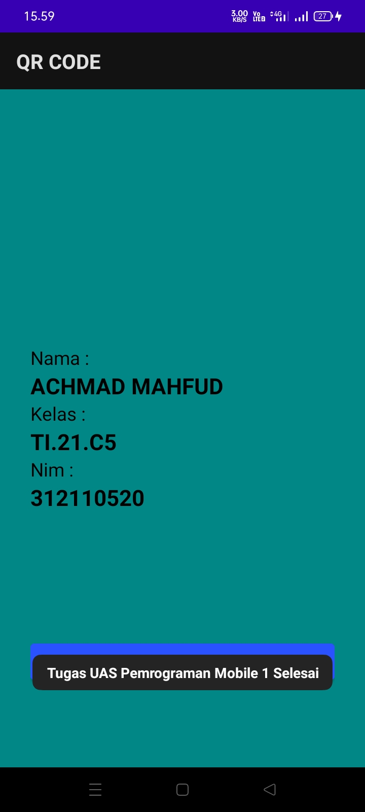
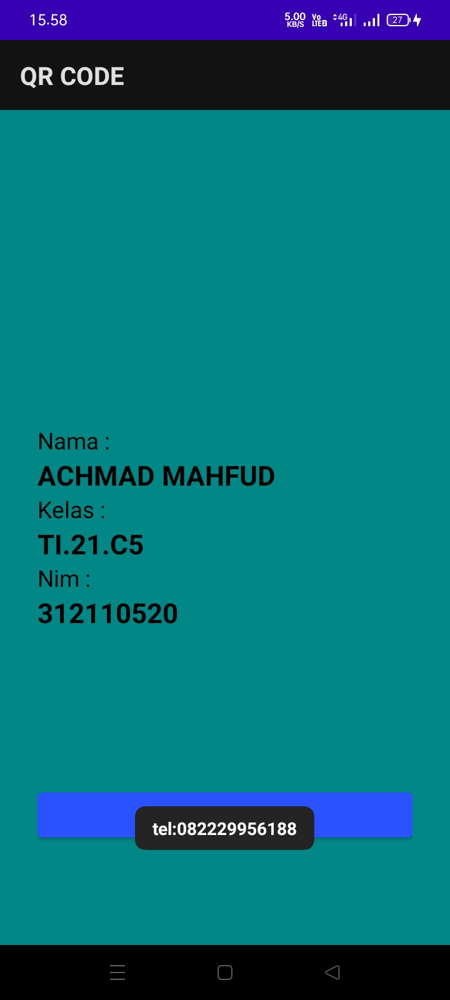
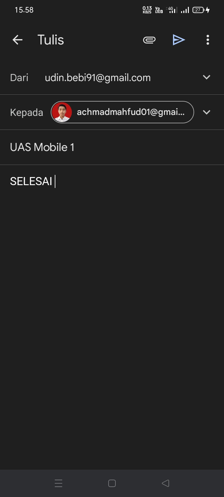
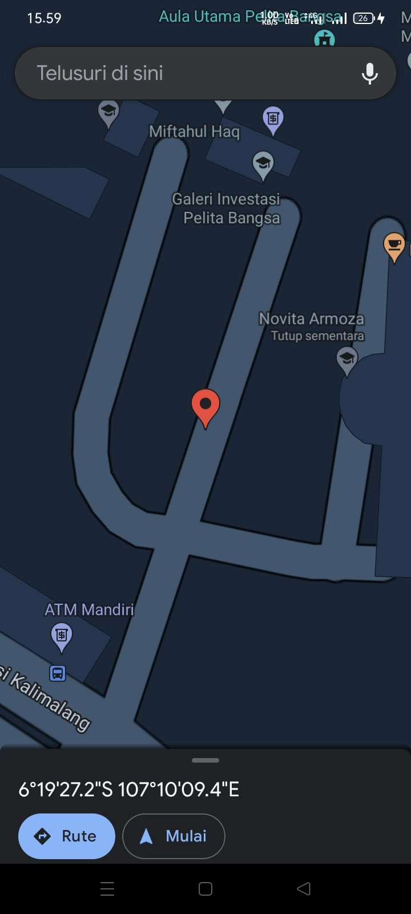

# **Tugas UAS Pemrograman  Mobile 1**

```sv
Nama    : Achmad Mahfud
NIM     : 312110520
Kelas   : TI.21.C5
```

## Project Aplikasi QR CODE 5 Fungsi : 
1. JSON
2. WebView
3. Phone Call
4. E Mail
5. G Maps

## Hasil Project :  
### **1. Menampilkan JSON**
Scan QR Code berikut :


Akan Menampilkan sebagai berikut :



### **2. Menampilkan WebView**
Scan QR Code berikut :


Akan Menampilkan sebagai berikut :


### **3. Menampilkan Phone Call**
Scan QR Code berikut :


Akan Menampilkan sebagai berikut :



### **4. Menampilkan E Mail**
Scan QR Code berikut :


Akan Menampilkan sebagai berikut :



### **5. Menampilkan G Maps**
Scan QR Code berikut :


Akan Menampilkan sebagai berikut :

